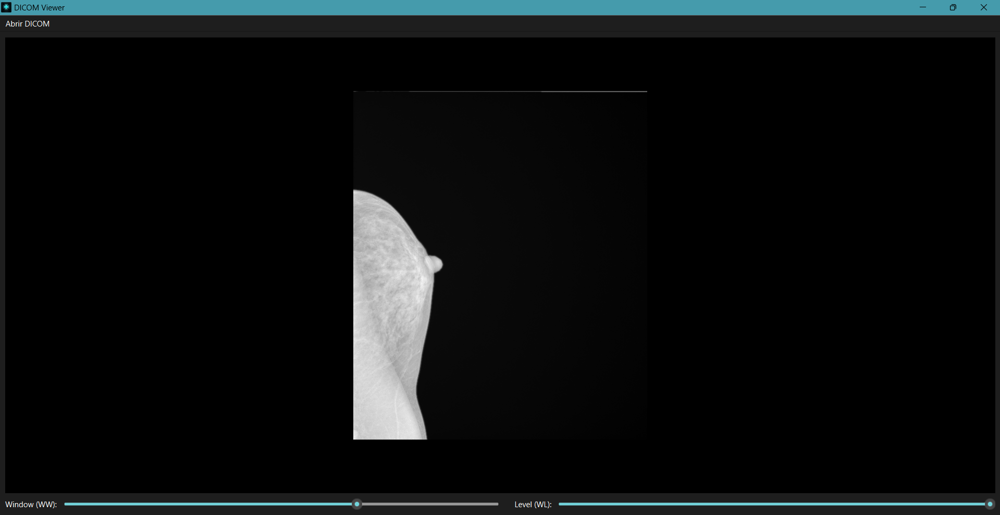
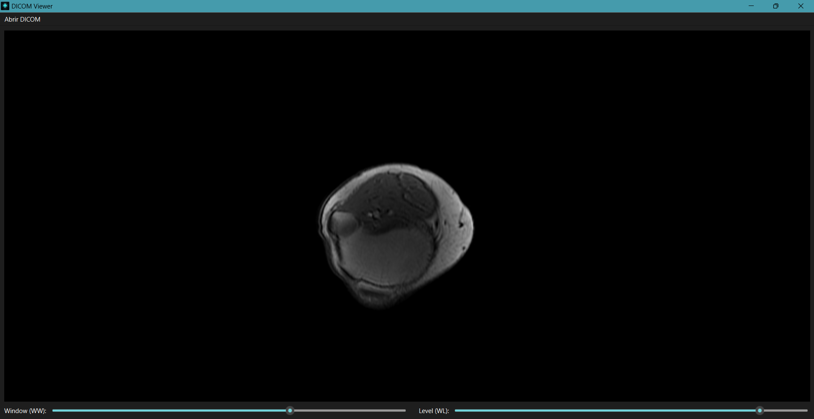

# DICOM Viewer


Aplicação desktop para abrir e visualizar imagens DICOM em escala de cinza, com WW/WL e fallback para DICOM comprimido.

## 📖 Descrição rápida
- 📂 Seleciona `.dcm` via janela de arquivos.
- 🖼️ Renderiza 2D com escala de cinza, dimensões corretas e WW/WL ajustáveis.
- ⚠️ Erro claro para arquivos inválidos/sem pixel data.
- 🔄 Pipeline: `vtkDICOMImageReader` → `vtkGDCMImageReader` (se disponível) → decoder manual GDCM (se instalado).

## 🧩 Bibliotecas
- C++17 · CMake
- Qt 5/6 (Widgets + OpenGL)
- VTK (RenderingOpenGL2, GUISupportQt, InteractionImage, IOImage, ImagingCore, CommonCore, etc.)
- GDCM (opcional, para DICOM comprimido)

## 🎬 Demonstração



## 🔧 Build e execução

### 🪟 Ambiente usado (Windows)
- IDE: VS Code (CMake Tools)
- Toolchain: Visual Studio (MSVC) x64
- Gerenciador: vcpkg habilitado (Qt/VTK/GDCM via vcpkg)

#### ⚡ Atalho (script)
```powershell
.\run.ps1
```
Configura, compila (Release) e executa `build/Release/dicom_viewer.exe`.

#### 🧭 Manual (VS Code)
- `Ctrl+Shift+P` → “CMake: Configure” (kit MSVC amd64, toolchain vcpkg)
- `Ctrl+Shift+P` → “CMake: Build” (Release)
- Executar: `.\build\Release\dicom_viewer.exe`

#### 💻 Manual (linha de comando)
```powershell
cmake -S . -B build -G "Visual Studio 18 2026" -A x64 -DCMAKE_TOOLCHAIN_FILE=<path_to_vcpkg>/scripts/buildsystems/vcpkg.cmake
cmake --build build --config Release
.\build\Release\dicom_viewer.exe
```

## 📂 Estrutura
```
.
├── assets/                    # logos (logo.png)
│   └── screenshots/           # capturas (dicom_example1.png, dicom_example2.png)
├── src/
│   ├── main.cpp               # ponto de entrada
│   └── MainWindow.h/.cpp      # UI + pipeline VTK/GDCM
├── CMakeLists.txt             # configuração de build
├── run.ps1                    # configure + build + run (Windows)
└── README.md                  # este guia
```

## 🗒️ Notas
- Com GDCM instalado, o fallback lida com compressões (ex.: JPEG lossless).
- Para DICOM sem pixel data, é exibida mensagem de erro.

## ✍️ Autoria
Desenvolvido por Matheus Dutra.
